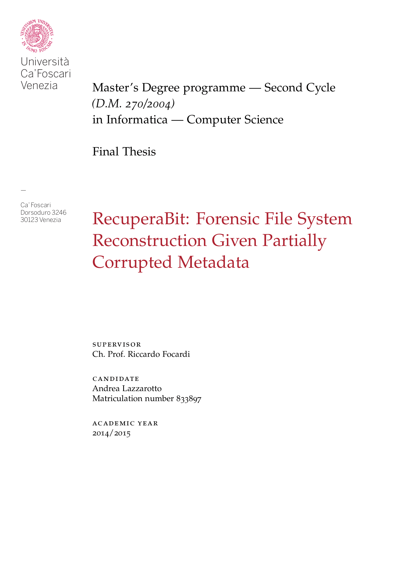
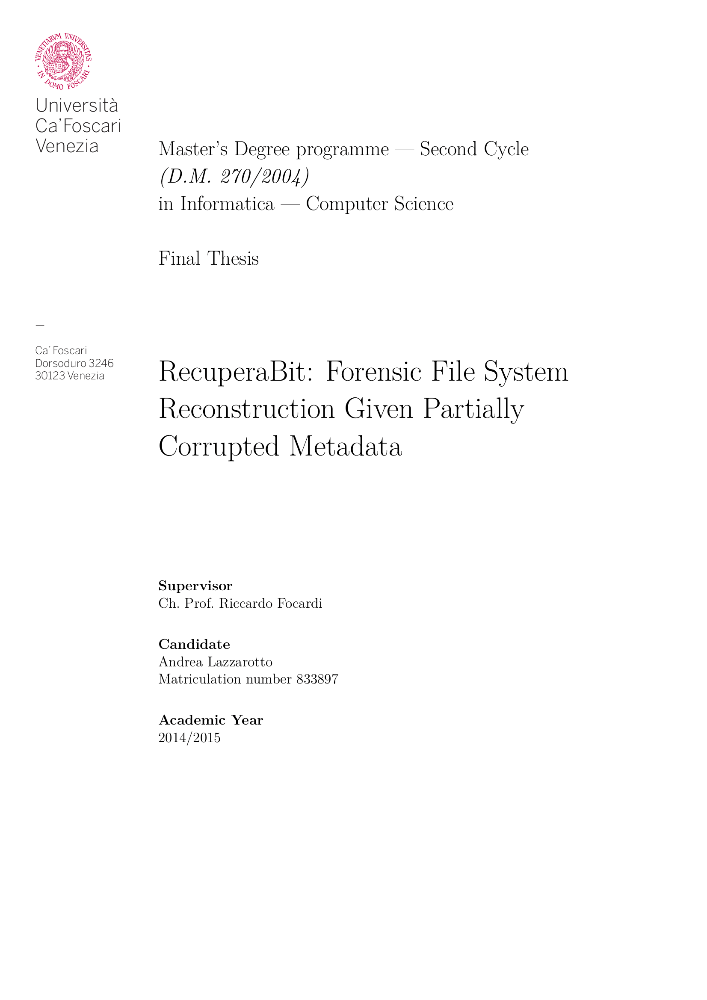
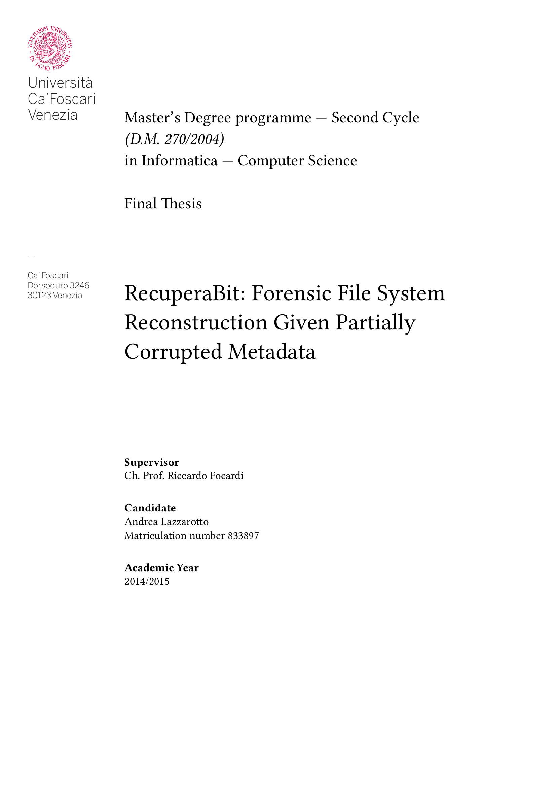
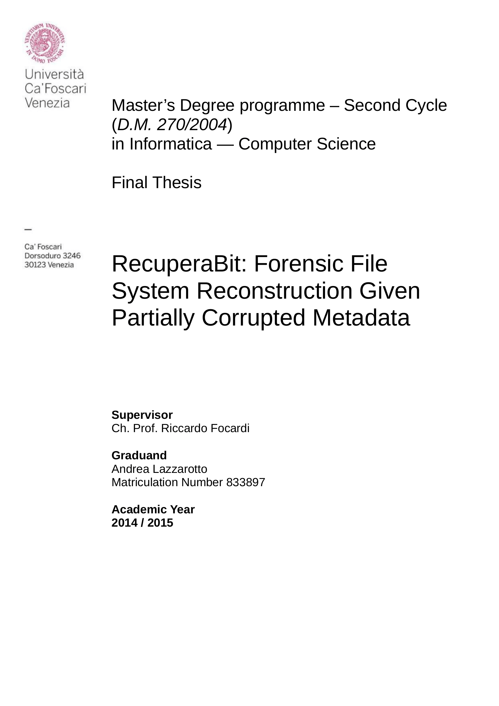

# Thesis Front Page for Ca' Foscari University of Venice (in LaTeX)

This repository contains a LaTeX port of the front page (in Italian *frontespizio*)
required for a thesis at Ca' Foscari University of Venice (Italy).

Since I used [ClassicThesis](https://bitbucket.org/amiede/classicthesis/wiki/Home)
and [LyX](http://www.lyx.org/) to write mine, I also provide a `.lyx` version of
the front page. I have made a tweaked template specifically for ClassicThesis,
however I also provide a generic one that works with any template.

The original document provided by Ca' Foscari University can be found
[here](http://www.unive.it/pag/fileadmin/user_upload/ateneo/Laurea/tesi/Frontespizio_Tesi_Laurea_inglese.rtf),
however it has some issues:

- it is in RTF format
- it is **huge** (more than 6 MB)
- despite the previous point, it has a very ugly, low-quality logo

I have re-drawn the logo and the text in full vector format, and the good news
is that the [official guidelines](http://www.unive.it/pag/8751/) include the
following sentence:

> Fonts and colors are free.

Thus you can use the same font as the rest of your document.

## Contents

The following files are provided:

- `Titlepage-Cafoscari-ClassicThesis-Config.tex`: configuration file for the
  ClassicThesis version
- `Titlepage-Cafoscari-ClassicThesis-Standalone.tex`: LaTeX document to compile
  the ClassicThesis version
- `Titlepage-Cafoscari-Generic-Config.tex`: configuration file for the
  generic version
- `Titlepage-Cafoscari-Generic-Standalone.tex`: LaTeX document to compile
  the generic version
- `Titlepage-Cafoscari.tex`: actual code to render the title page
- `Titlepage-Cafoscari.lyx`: LyX file for the ClassicThesis version
- `ExampleThesis.tex`: example showing how to integrate the front page in your
  thesis
- `gfx/00_cafoscari.pdf`: logo of Ca' Foscari University

Packages `graphicx` and `textpos` are required.

## Usage

### LyX Version (ClassicThesis)

Copy the `Titlepage-Cafoscari.lyx` file in the same directory as the other LyX
files of the ClassicThesis for LyX template. Make sure to merge the contents of
the `gfx` directory as well. Modify `ClassicThesis.lyx` to replace the old first
page.

### ClassicThesis Version

Make sure the necessary files are located in the directory of the template (the
one including `classicthesis-config.tex`). Customize the contents of
`Titlepage-Cafoscari-ClassicThesis-Config.tex` and then add the following at the
end of the preamble in the main document:

    \input{Titlepage-Cafoscari-ClassicThesis-Config}

Compile file `Titlepage-Cafoscari-ClassicThesis-Standalone.tex` to check that
everything is OK.

To integrate the front page in your file, put this after `\begin{document}`,
replacing the old one:

    \input{Titlepage-Cafoscari}
    \cleardoublepage

### Generic Version

Customize the contents of `Titlepage-Cafoscari-Generic-Config.tex` (the names
of the commands are mostly borrowed from ClassicThesis). Add the following at
the end of the preamble of your thesis:

    \input{Titlepage-Cafoscari-Generic-Config}

Compile file `Titlepage-Cafoscari-Generic-Standalone.tex` to check that
everything is OK.

To integrate the front page in your file, put this after `\begin{document}`:

    \input{Titlepage-Cafoscari}
    \cleardoublepage

You can have a look at file `ExampleThesis.tex` to see how the page can be
integrated in a document.

## License

These files are MIT licensed. I do not require that you put the copyright notice
in the compiled version of your file, however you should include it in a comment
if you share the LaTeX source code of your thesis, or a forked version of this
repository.

## Screenshots

### ClassicThesis

### Generic (Latin Modern)

### Generic (Linux Libertine)

### Original RTF Template by Ca' Foscari University

